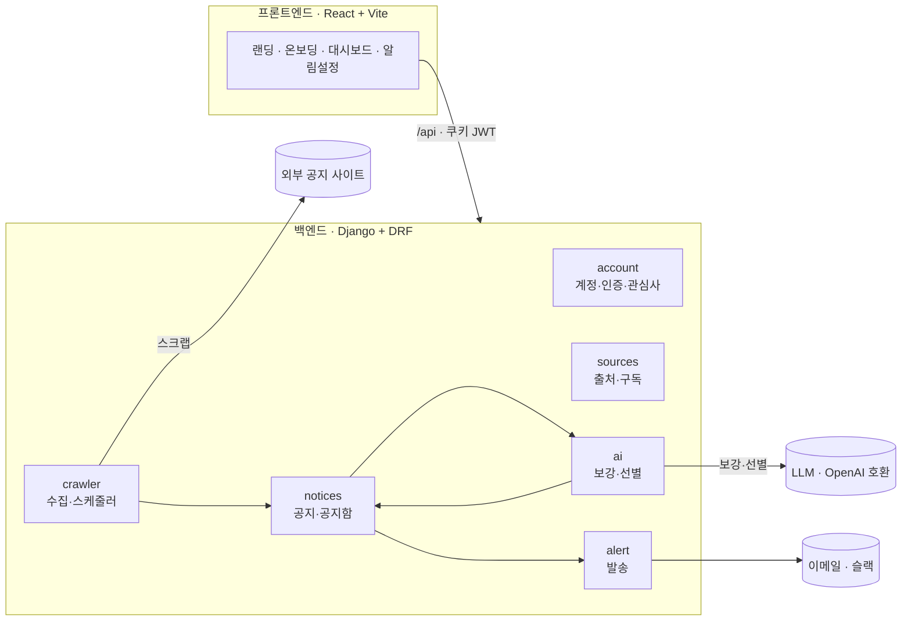

# 꽁알꽁알 (Kkongal)

> 맞춤 공지 알리미 — 흩어진 공지를 한곳에서, AI가 필요한 것만 골라 이메일·슬랙으로 알려드립니다.

채용 플랫폼, 학교·학부 공지, 관심 기업 채용 페이지, 장학금·공모전·대외활동 등 여러 사이트를 매일 따로 확인하는 **탐색 비용**을 줄여주는 웹 서비스다. 사용자가 관심 사이트와 관심 조건(키워드 + 자연어)을 등록하면, 시스템이 각 사이트의 새 공지를 자동으로 수집하고 LLM 이 사용자의 관심사·프로필에 맞는 공지만 의미 기준으로 선별해 하나의 대시보드로 모아 보여주고, 선택한 채널로 알림을 보낸다.

## 개요

- 초기 구상·기획: [IR Deck](docs/IR_Deck.pdf) · [100초 피칭 영상](https://youtu.be/MK0nMy_avfU)
- 배포 URL: https://kkongal.cloud
- 데이터 모델 ERD: [docs/data-model.md](docs/data-model.md) · [FigJam](https://www.figma.com/board/JGuLClw7NbtdzpWPj89m27/Kkongal-ERD)
- 요구사항·명세: [docs/REQUIREMENTS.md](docs/REQUIREMENTS.md)

**주요 기능**

- **사이트 등록**: 카탈로그에서 고르거나 URL 을 직접 등록한다. 크롤링 기반이라 RSS 를 제공하지 않는 사이트도 다룬다.
- **자동 수집**: 등록된 사이트의 공지를 주기적으로 확인해 제목·본문·게시일·마감일을 구조화해 저장한다.
- **AI 보강·선별**: 공지당 1회 요약·정리(markdown)·마감일을 뽑고(enrich), LLM 이 사용자 관심 조건과 의미 기준으로 대조해 관련도·선별 사유와 함께 필요한 것만 남긴다(classify).
- **통합 대시보드**: 선별된 공지를 출처·시간·관련도와 함께 한 화면에 모아 보여준다.
- **멀티채널 알림**: 새 공지를 이메일·슬랙으로 전달한다. 중복 발송은 막는다.

## 구성



**파이프라인**: `crawl(수집) → enrich(공지당 1회 보강) → classify(사용자별 선별) → dispatch(알림 발송)`.

| 영역     | 사용 기술                                                                          |
| -------- | ---------------------------------------------------------------------------------- |
| Frontend | React 19, Vite, JavaScript(JSX), lucide-react                                      |
| Backend  | Python 3.12, Django 6, Django REST Framework, SQLite                               |
| Crawler  | httpx, BeautifulSoup(lxml), pydantic — 정적 HTML                                   |
| AI       | OpenAI 호환 LLM 3단 캐스케이드 (1차 Gemini Flash‑Lite → 2차 Gemma → 결정론적 폴백) |
| Alert    | 이메일(SMTP), 슬랙(Incoming Webhook)                                               |

```
kkongal/
├── frontend/          # React + Vite 웹 클라이언트 (로고: src/assets/logo.png)
├── backend/           # Django 서버 (SQLite)
│   ├── account/       # 사용자·인증(쿠키 JWT)·관심사
│   ├── sources/       # 공지 출처·구독·카탈로그·동기화
│   ├── notices/       # 공지 원본·사용자별 공지함(inbox)
│   ├── crawler/       # 공지 수집(스크래핑)·스케줄러
│   ├── ai/            # LLM 보강·선별
│   └── alert/         # 이메일·슬랙 알림 발송
└── docs/              # 요구사항·데이터 모델·IR Deck
```

각 앱의 상세는 [backend/README.md](backend/README.md) 와 앱별 README 를, 프론트는 [frontend/README.md](frontend/README.md) 를 참고한다.

## 흐름 · 사용법

### 1) 백엔드 (Django)

```bash
cd backend
uv venv --python 3.12 .venv          # 또는: python3.12 -m venv .venv
uv pip install -r requirements.txt   # 또는: .venv/bin/pip install -r requirements.txt

cp .env.example .env                 # 값 채우기 (아래 "환경 변수" 참고)
.venv/bin/python manage.py migrate
.venv/bin/python manage.py runserver # http://127.0.0.1:8000
```

### 2) 프론트엔드 (React + Vite)

```bash
cd frontend
npm install
npm run dev                          # http://localhost:3000 (→ /api 는 백엔드로 프록시)
```

> dev 서버는 3000 포트에서 뜨고 `/api` 요청을 백엔드(127.0.0.1:8000)로 프록시하므로, JWT 쿠키가 same-origin(first-party)으로 처리된다. CORS·SameSite 설정이 필요 없다.

### 3) 수집 → 선별 → 알림 파이프라인

```bash
# 한 번에 (스케줄러/cron 용): (크롤) → 보강 → 선별 → 발송
.venv/bin/python manage.py run_pipeline --crawl

# 주기 루프: due 사이트 크롤 → 보강 → 선별 → 발송
.venv/bin/python manage.py run_scheduler --once          # 한 틱만
.venv/bin/python manage.py run_scheduler --interval-minutes 30

# 단계별 개별 실행
.venv/bin/python manage.py crawl_notices --source snu_cse_notice --no-match
.venv/bin/python manage.py classify_notices
.venv/bin/python manage.py dispatch_alerts
```

사용자는 웹 UI 의 사이트별 **동기화** 버튼으로도 즉시 크롤·선별을 돌릴 수 있다(`POST /api/sources/<id>/sync/`).

### 환경 변수

모든 비밀 값은 `backend/.env` 로 관리하며 커밋하지 않는다(`backend/.env.example` 참고). 핵심 항목:

- `SECRET_KEY` — Django 시크릿.
- `LLM_API_KEY`(선택), `LLM_BASE_URL`, `LLM_MODEL`(1차), `LLM_FALLBACK_MODEL`(2차) — AI 선별·보강은 **3단 캐스케이드**(1차 `LLM_MODEL` → 2차 `LLM_FALLBACK_MODEL` → 결정론적 키워드 폴백)로 동작한다. 두 LLM 계층은 **같은 `LLM_BASE_URL`·`LLM_API_KEY`** 를 공유하고 모델 문자열만 다르다(제공자 교체 = base_url·model·key 변경 → OpenAI·DeepSeek·Groq 등). 키가 비거나 두 LLM 계층이 모두 실패하면 키워드 폴백으로 동작한다. `LLM_MIN_REQUEST_INTERVAL_SECONDS`(기본 4.5초)는 요청 간 최소 간격을 둬 무료 티어 분당 한도(~15 RPM)를 방어한다.
- 이메일 `EMAIL_*` — 기본은 콘솔 출력. 실제 발송은 `EMAIL_BACKEND=...smtp.EmailBackend` + SMTP 자격 증명. **587(STARTTLS)이 막히는 망에서는 465(SSL): `EMAIL_PORT=465`·`EMAIL_USE_SSL=True`·`EMAIL_USE_TLS=False`** 로 전환한다.
- `FRONTEND_URL` — 알림 메시지의 "대시보드에서 보기" 링크 등에 사용.
- 슬랙 Webhook 은 서버 설정이 아니라 **사용자별로 웹 UI(알림 설정)에서** 등록한다.

## 유의사항

- **무료 LLM 할당량 · 3단 캐스케이드**: 무료 티어는 사용량 소진 시 429 가 날 수 있다. 이때는 먼저 2차 폴백 모델(`LLM_FALLBACK_MODEL`, 같은 키·URL)로 자동 전환하고, **두 LLM 계층이 모두 실패할 때만** 키워드 폴백으로 내려가며 대시보드에 "키워드 기반 임시 동작 중" 배너가 뜬다(`GET /api/ai/status/`). 요청 간 최소 간격(`LLM_MIN_REQUEST_INTERVAL_SECONDS`)으로 분당 요청수(RPM)를 방어하며, 잠시 후 자동 정상화된다.
- **비용 최소화(NFR-6)**: 보강은 공지당 1회, 선별은 `(공지,사용자)` 쌍당 1회만 LLM 을 부른다. 상시 스케줄러 실행은 비용이 누적되므로 데모에서는 `run_scheduler --once` 나 동기화 버튼을 권장한다.
- **이메일 587 vs 465**: 위 환경 변수 참고. TLS(587)와 SSL(465)은 동시에 켤 수 없다.
- **데모 시드 없음**: 별도 시드 명령은 두지 않는다. 실제 데이터는 사이트 등록 후 크롤/동기화로 채운다(테스트는 각 앱이 필요한 객체를 직접 생성).
- **크롤링 예의(NFR-5)**: 여러 외부 사이트에 연속 요청하므로 요청 간 지연을 둔다. 개별 확인은 `--source` 로 한 사이트씩 하는 것을 권장한다.

## 팀

| 이름             | GitHub                                           | 역할                                          |
| ---------------- | ------------------------------------------------ | --------------------------------------------- |
| **양현서**(팀장) | [@yanghyeonseo](https://github.com/yanghyeonseo) | 기획 / AI 선별·알림 기능 / 프론트·백엔드 지원 |
| **서지안**       | [@Seo-Jian](https://github.com/Seo-Jian)         | 프론트엔드 (대시보드·사이트 등록 UI)          |
| **윤지후**       | [@jeehooy2](https://github.com/jeehooy2)         | 백엔드 (크롤링·수집 파이프라인, 서버 로직)    |
| **배진규**       | [@r2rboss1](https://github.com/r2rboss1)         | 백엔드 (크롤링·수집 파이프라인, 서버 로직)    |
