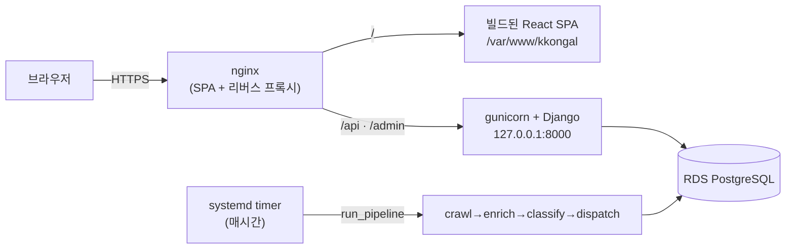

# 배포 가이드 (AWS · Docker 없이)

동아리 운영을 고려해 **Docker 없이** 표준 리눅스 방식(EC2 + systemd + nginx)으로 배포한다.
필요하면 나중에 컨테이너로 옮겨도 되지만, 이 문서는 팀이 그대로 따라 할 수 있는
가장 단순한 경로를 다룬다.

## 구성



- **웹**: nginx 하나가 SPA(정적 파일)를 서빙하고 `/api`·`/admin` 을 gunicorn 으로 넘긴다.
  SPA 와 API 가 같은 오리진이라 JWT 쿠키가 first-party 로 오간다(CORS 불필요).
- **앱**: gunicorn 이 Django(WSGI)를 구동. `--workers 1`(아래 주의 참고).
- **DB**: SQLite 대신 **RDS PostgreSQL**(`DATABASE_URL` 로 주입). 재배포·인스턴스 교체와 무관하게 데이터 보존.
- **주기 작업**: 상주 스케줄러 대신 **systemd 타이머**가 `manage.py run_pipeline` 을 매시간 1회 실행.

관련 파일: `deploy/nginx-kkongal.conf`, `deploy/kkongal.service`,
`deploy/kkongal-pipeline.service`·`.timer`, `backend/gunicorn.conf.py`.

## 사전 준비

- **EC2** 인스턴스(Ubuntu 22.04+ 권장), 탄력적 IP, 보안그룹에서 80/443 오픈.
- **RDS PostgreSQL**(db.t4g.micro 로 충분). 보안그룹에서 EC2 → RDS 5432 허용.
- 도메인 `kkongal.cloud` 의 A 레코드를 EC2 IP 로.
- LLM/이메일/슬랙 자격 증명(선택, 없어도 데모 동작).

## 프로덕션 환경 변수

`backend/.env` 에 아래를 채운다(자세한 주석은 `backend/.env.example` 참고). `.env` 는 커밋 금지.

| 변수 | 예시 / 설명 |
| --- | --- |
| `SECRET_KEY` | `python -c "from django.core.management.utils import get_random_secret_key as g; print(g())"` |
| `DEBUG` | `False` (필수) |
| `ALLOWED_HOSTS` | `kkongal.cloud` |
| `CSRF_TRUSTED_ORIGINS` | `https://kkongal.cloud` |
| `DATABASE_URL` | `postgres://USER:PW@RDS_HOST:5432/kkongal` |
| `FRONTEND_URL` | `https://kkongal.cloud` (알림 링크에 사용) |
| `LLM_API_KEY` 등 | LLM/이메일/슬랙 설정(선택) |

> `DEBUG=False` 이면 `SECURE_*`(HTTPS 리다이렉트·HSTS)와 Secure 쿠키가 자동으로 켜진다.
> nginx 가 `X-Forwarded-Proto` 를 넘기므로 request.is_secure() 가 HTTPS 뒤에서도 정상 동작한다.

## 배포 절차

### 1) 서버 패키지

```bash
sudo apt update
sudo apt install -y python3.12 python3.12-venv nginx git libpq5
# Node(프론트 빌드용) — nvm 또는 nodesource 로 22.x 설치
```

### 2) 코드 · 백엔드 준비

```bash
git clone <repo> /home/ubuntu/kkongal
cd /home/ubuntu/kkongal/backend
python3.12 -m venv .venv
.venv/bin/pip install -r requirements.txt

cp .env.example .env         # 위 표대로 값 채우기 (DEBUG=False!)
.venv/bin/python manage.py migrate
.venv/bin/python manage.py collectstatic --noinput
.venv/bin/python manage.py createsuperuser   # (선택) 관리자
```

### 3) 프론트 빌드 → 정적 배포

```bash
cd /home/ubuntu/kkongal/frontend
npm ci && npm run build
sudo mkdir -p /var/www/kkongal
sudo cp -r dist/* /var/www/kkongal/
```

### 4) gunicorn (systemd)

```bash
sudo cp deploy/kkongal.service /etc/systemd/system/kkongal.service
sudo systemctl daemon-reload
sudo systemctl enable --now kkongal
sudo systemctl status kkongal        # active 확인
```

### 5) nginx + HTTPS

```bash
sudo cp deploy/nginx-kkongal.conf /etc/nginx/sites-available/kkongal
sudo ln -s /etc/nginx/sites-available/kkongal /etc/nginx/sites-enabled/kkongal
sudo rm -f /etc/nginx/sites-enabled/default
sudo nginx -t && sudo systemctl reload nginx

# Let's Encrypt 인증서 발급(443/HTTPS 설정을 자동 추가)
sudo apt install -y certbot python3-certbot-nginx
sudo certbot --nginx -d kkongal.cloud
```

### 6) 주기 파이프라인 (systemd 타이머)

```bash
sudo cp deploy/kkongal-pipeline.service /etc/systemd/system/
sudo cp deploy/kkongal-pipeline.timer   /etc/systemd/system/
sudo systemctl daemon-reload
sudo systemctl enable --now kkongal-pipeline.timer
systemctl list-timers kkongal-pipeline.timer   # 다음 실행 시각
```

### 7) 헬스체크

```bash
curl -s https://kkongal.cloud/api/healthz/     # {"status": "ok"}
```

## 재배포(업데이트) 절차

```bash
cd /home/ubuntu/kkongal && git pull
# 백엔드
cd backend && .venv/bin/pip install -r requirements.txt
.venv/bin/python manage.py migrate
.venv/bin/python manage.py collectstatic --noinput
sudo systemctl restart kkongal
# 프론트
cd ../frontend && npm ci && npm run build && sudo cp -r dist/* /var/www/kkongal/
```

## 주의사항

- **gunicorn `--workers 1` 고정.** 인메모리 동기화 워커·LocMem 캐시가 프로세스 로컬이라
  worker 를 늘리면 동기화 중복/캐시 조각이 생긴다. 트래픽이 커지면 Redis 공유 캐시를 먼저
  도입한 뒤 확장한다(`backend/gunicorn.conf.py` 주석 참고).
- **SQLite → Postgres.** 로컬은 SQLite 로 동작하지만 서버는 반드시 `DATABASE_URL` 로 RDS 를
  쓴다(재시작·재배포에도 데이터 보존). 코드는 순수 ORM 이라 엔진 전환에 추가 작업이 없다.
- **시크릿 관리.** 규모가 커지면 `.env` 대신 AWS SSM Parameter Store/Secrets Manager 에서
  주입하는 것을 권장한다(설정은 그대로 환경 변수로 읽는다).

## (선택) Docker 로 가고 싶다면

컨테이너가 익숙해지면 위 구성을 그대로 이미지화할 수 있다: 백엔드는
`gunicorn -c gunicorn.conf.py kkongal.wsgi` 를 CMD 로, 프론트는 빌드 후 nginx 이미지에 얹고
`deploy/nginx-kkongal.conf` 를 컨테이너용으로 살짝 손보면 된다. 이 저장소는 기본적으로
Docker 를 요구하지 않는다.
