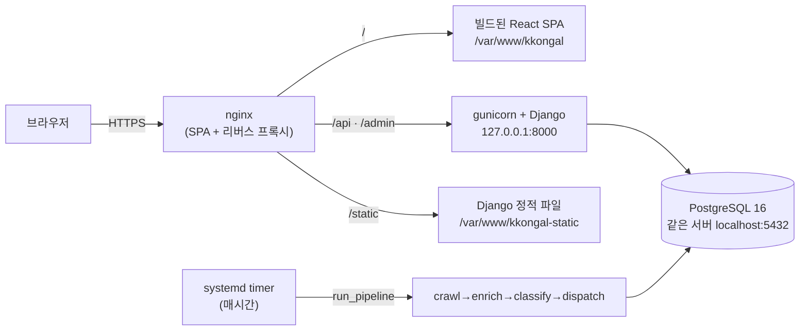

# 배포 가이드 (가비아 서버 · Docker 없이)

동아리 운영을 고려해 **Docker 없이** 표준 리눅스 방식(가비아 클라우드 서버 + systemd + nginx)으로
배포한다. 필요하면 나중에 컨테이너로 옮겨도 되지만, 이 문서는 팀이 그대로 따라 할 수 있는
가장 단순한 경로를 다룬다.

> 현재 운영 환경: 가비아 도메인 `kkongal.cloud` + 가비아 Ubuntu 24.04 서버(`1.201.116.78`).
> 예전 AWS(EC2 + RDS) 배포의 흔적은 `deploy-gabia` 브랜치에서 정리했다.

## 구성



- **웹**: nginx 하나가 SPA(정적 파일)를 서빙하고 `/api`·`/admin` 을 gunicorn 으로 넘긴다.
  SPA 와 API 가 같은 오리진이라 JWT 쿠키가 first-party 로 오간다(CORS 불필요).
  프론트의 `API_BASE_URL` 은 반드시 빈 문자열이어야 한다(`frontend/src/api/client.js`).
- **앱**: gunicorn 이 Django(WSGI)를 구동. `--workers 1`(아래 주의 참고).
- **DB**: 서버에 직접 설치한 **PostgreSQL 16**(`DATABASE_URL` 로 주입). 관리형 DB(RDS 등)를
  쓰지 않으므로 백업은 아래 "백업" 절을 따른다.
- **정적 파일**: `collectstatic` 산출물을 `/var/www/kkongal-static` 으로 복사해 nginx 가 서빙한다.
  nginx 가 `/home/ubuntu` 를 traverse 할 필요가 없어 홈 디렉터리 권한을 열지 않아도 되고,
  `.env` 같은 비밀 파일이 노출될 위험도 없다.
- **주기 작업**: 상주 스케줄러 대신 **systemd 타이머**가 `manage.py run_pipeline` 을 매시간 1회 실행.

관련 파일: `deploy/nginx-kkongal.conf`, `deploy/kkongal.service`,
`deploy/kkongal-pipeline.service`·`.timer`, `deploy/redeploy.sh`, `backend/gunicorn.conf.py`.

## 사전 준비

- **가비아 서버**(Ubuntu 24.04 기준), SSH 키.
- **가비아 방화벽에서 TCP 80 · 443 인바운드 허용.** 서버는 NAT 뒤에 있고 기본적으로 22 만
  열려 있다. 이걸 열지 않으면 서버 안에서는 정상 동작해도 외부에서 접속이 안 되고
  certbot 인증서 발급(HTTP-01 챌린지)도 실패한다.
- **가비아 DNS 관리**에서 `kkongal.cloud` 의 A 레코드를 서버 IP 로. (`www` 도 함께 권장.)
- LLM/이메일/슬랙 자격 증명(선택, 없어도 데모 동작).

## 프로덕션 환경 변수

`backend/.env` 에 아래를 채운다(자세한 주석은 `backend/.env.example` 참고). `.env` 는 커밋 금지이며
`chmod 600` 으로 둔다.

| 변수 | 예시 / 설명 |
| --- | --- |
| `SECRET_KEY` | `python -c "from django.core.management.utils import get_random_secret_key as g; print(g())"` |
| `DEBUG` | `False` (필수) |
| `ALLOWED_HOSTS` | `kkongal.cloud,www.kkongal.cloud,1.201.116.78,127.0.0.1,localhost` |
| `CSRF_TRUSTED_ORIGINS` | `https://kkongal.cloud,https://www.kkongal.cloud` |
| `DATABASE_URL` | `postgres://kkongal:PW@127.0.0.1:5432/kkongal` |
| `FRONTEND_URL` | `https://kkongal.cloud` (알림 링크에 사용) |
| `SECURE_SSL_REDIRECT` | `False` — HTTP→HTTPS 리다이렉트는 앞단 nginx(certbot)가 담당 |
| `AUTH_COOKIE_SECURE` | 인증서 발급 전엔 `False`, HTTPS 를 켠 뒤 `True` |
| `LLM_API_KEY` 등 | LLM/이메일/슬랙 설정(선택) |

> `DEBUG=False` 이면 HSTS·`SECURE_CONTENT_TYPE_NOSNIFF` 와 Secure 세션/CSRF 쿠키가 자동으로 켜진다.
> nginx 가 `X-Forwarded-Proto` 를 넘기므로 `request.is_secure()` 가 HTTPS 뒤에서도 정상 동작한다.

## 배포 절차

### 1) 서버 패키지

```bash
sudo apt update
sudo apt install -y python3.12-venv python3.12-dev build-essential \
  nginx postgresql postgresql-contrib libpq-dev certbot python3-certbot-nginx
# Node 22 (프론트 빌드용)
curl -fsSL https://deb.nodesource.com/setup_22.x | sudo -E bash -
sudo apt install -y nodejs
```

### 2) PostgreSQL

```bash
sudo -u postgres createuser kkongal
sudo -u postgres psql -c "ALTER ROLE kkongal WITH LOGIN PASSWORD '<강한-비밀번호>';"
sudo -u postgres createdb -O kkongal -E UTF8 -T template0 -l C.UTF-8 kkongal
sudo -u postgres psql -c "ALTER ROLE kkongal CREATEDB;"   # manage.py test 용
```

기본 설정 그대로면 PostgreSQL 은 `127.0.0.1` 에서만 듣는다(외부 노출 없음).

### 3) 코드 · 백엔드 준비

```bash
git clone <repo> /home/ubuntu/kkongal
cd /home/ubuntu/kkongal/backend
python3.12 -m venv .venv
.venv/bin/pip install -r requirements.txt

cp .env.example .env && chmod 600 .env   # 위 표대로 값 채우기 (DEBUG=False!)
.venv/bin/python manage.py migrate
.venv/bin/python manage.py collectstatic --noinput
.venv/bin/python manage.py createsuperuser   # 관리자(/admin) 계정
```

### 4) 프론트 빌드 → 정적 배포

```bash
cd /home/ubuntu/kkongal/frontend
npm ci && npm run build
sudo mkdir -p /var/www/kkongal /var/www/kkongal-static
sudo rsync -a --delete dist/ /var/www/kkongal/
sudo rsync -a --delete ../backend/staticfiles/ /var/www/kkongal-static/
sudo chown -R www-data:www-data /var/www/kkongal /var/www/kkongal-static
```

### 5) gunicorn (systemd)

```bash
sudo cp deploy/kkongal.service /etc/systemd/system/kkongal.service
sudo systemctl daemon-reload
sudo systemctl enable --now kkongal
sudo systemctl status kkongal        # active 확인
```

### 6) nginx + HTTPS

```bash
sudo cp deploy/nginx-kkongal.conf /etc/nginx/sites-available/kkongal
sudo ln -sf /etc/nginx/sites-available/kkongal /etc/nginx/sites-enabled/kkongal
sudo rm -f /etc/nginx/sites-enabled/default
sudo nginx -t && sudo systemctl reload nginx

# ⚠️ 아래는 가비아 방화벽에서 80/443 을 열고 A 레코드가 전파된 뒤에 실행한다.
sudo certbot --nginx -d kkongal.cloud -d www.kkongal.cloud
# 발급 후: .env 의 AUTH_COOKIE_SECURE=True 로 바꾸고
sudo systemctl restart kkongal
```

certbot 은 `certbot.timer` 로 자동 갱신된다(`systemctl list-timers certbot.timer` 로 확인).

### 7) 주기 파이프라인 (systemd 타이머)

```bash
sudo cp deploy/kkongal-pipeline.service /etc/systemd/system/
sudo cp deploy/kkongal-pipeline.timer   /etc/systemd/system/
sudo systemctl daemon-reload
sudo systemctl enable --now kkongal-pipeline.timer
systemctl list-timers kkongal-pipeline.timer   # 다음 실행 시각
journalctl -u kkongal-pipeline -f              # 실행 로그
```

### 8) 헬스체크

```bash
curl -s https://kkongal.cloud/api/healthz/     # {"status": "ok"}
# 도메인 연결 전에는 서버 안에서:
curl -s -H 'Host: kkongal.cloud' http://127.0.0.1/api/healthz/
```

## 재배포(업데이트) 절차

`deploy/redeploy.sh` 가 위 과정을 한 번에 돌린다.

```bash
ssh ubuntu@kkongal.cloud
~/kkongal/deploy/redeploy.sh          # main 최신으로 재배포
~/kkongal/deploy/redeploy.sh <브랜치>  # 특정 브랜치로 재배포
```

수동으로 하려면:

```bash
cd /home/ubuntu/kkongal && git pull
cd backend && .venv/bin/pip install -r requirements.txt
.venv/bin/python manage.py migrate
.venv/bin/python manage.py collectstatic --noinput
sudo rsync -a --delete staticfiles/ /var/www/kkongal-static/
sudo systemctl restart kkongal
cd ../frontend && npm ci && npm run build
sudo rsync -a --delete dist/ /var/www/kkongal/
```

## 운영

### 로그

```bash
journalctl -u kkongal -f            # API 서버(gunicorn + Django)
journalctl -u kkongal-pipeline -f   # 주기 파이프라인
sudo tail -f /var/log/nginx/error.log
```

### 백업

관리형 DB 가 아니므로 스냅샷을 직접 떠야 한다. 예: 매일 새벽 4시 덤프(최근 14일 보관).

```bash
sudo -u postgres sh -c 'mkdir -p /var/backups/kkongal'
sudo crontab -e
# 0 4 * * * sudo -u postgres pg_dump -Fc kkongal > /var/backups/kkongal/kkongal-$(date +\%F).dump \
#           && find /var/backups/kkongal -name '*.dump' -mtime +14 -delete
```

복원: `sudo -u postgres pg_restore -d kkongal --clean /var/backups/kkongal/<파일>.dump`

## 주의사항

- **가비아 방화벽 80/443.** 서버 내부의 ufw/iptables 가 열려 있어도 가비아 콘솔에서 인바운드를
  허용하지 않으면 외부 접속이 안 된다. 배포가 "서버 안에서는 되는데 밖에서는 안 될" 때 첫 번째 확인 지점.
- **gunicorn `--workers 1` 고정.** 인메모리 동기화 워커·LocMem 캐시가 프로세스 로컬이라
  worker 를 늘리면 동기화 중복/캐시 조각이 생긴다. 트래픽이 커지면 Redis 공유 캐시를 먼저
  도입한 뒤 확장한다(`backend/gunicorn.conf.py` 주석 참고).
- **SQLite → Postgres.** 로컬은 SQLite 로 동작하지만 서버는 반드시 `DATABASE_URL` 로 PostgreSQL 을
  쓴다(재시작·재배포에도 데이터 보존). 코드는 순수 ORM 이라 엔진 전환에 추가 작업이 없다.
- **프론트 `API_BASE_URL` 은 비워둔다.** 여기에 절대 URL 을 박으면 동일 오리진 전제가 깨져
  JWT 쿠키가 third-party 가 되고 로그인이 풀린다.
- **시크릿 관리.** `.env` 는 `chmod 600` 으로 두고 커밋하지 않는다.

## (선택) Docker 로 가고 싶다면

컨테이너가 익숙해지면 위 구성을 그대로 이미지화할 수 있다: 백엔드는
`gunicorn -c gunicorn.conf.py kkongal.wsgi` 를 CMD 로, 프론트는 빌드 후 nginx 이미지에 얹고
`deploy/nginx-kkongal.conf` 를 컨테이너용으로 살짝 손보면 된다. 이 저장소는 기본적으로
Docker 를 요구하지 않는다.
