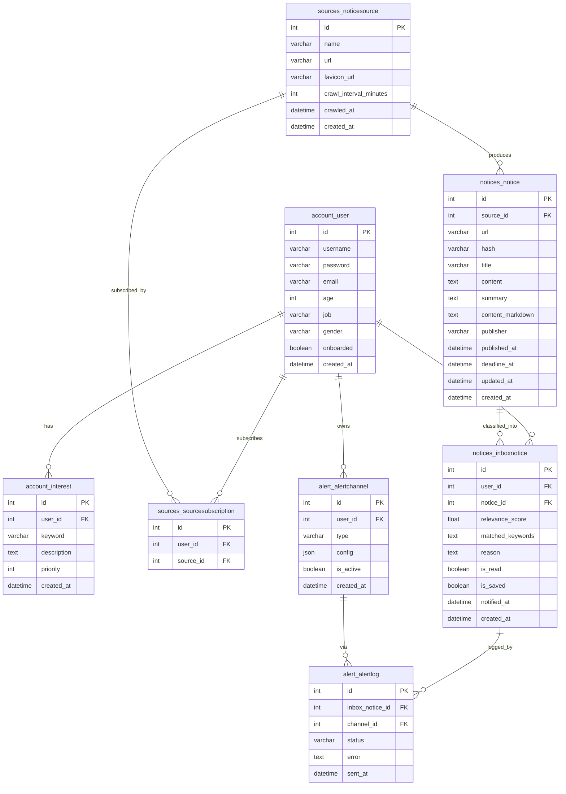

# kkongal — 데이터 모델 (Data Model)

> 공지 출처(`notice_sources`)를 전역으로 두고 구독(`source_subscription`)으로 연결하며, 수집한 공지(`notices`)를 사용자 관심 조건(`interests`)과 LLM 으로 선별해 개인 피드(`inbox_notice`)로 만들고, 이메일·슬랙 채널(`alert_channels`)로 알림을 보낸다.

> 이 문서는 **실제 구현된 Django 모델(as-built)** 을 기준으로 한다. 초기 스펙과 달라진 점은 각 표 아래 주석으로 표시한다. FigJam ERD(초기 설계): https://www.figma.com/board/JGuLClw7NbtdzpWPj89m27/Kkongal-ERD

## 1. 엔티티 상세

표기: 🔑 PK, 🔗 FK. id 는 모두 자동 증가 정수다.

### account_user — 사용자 (`account.User`, AbstractUser 확장)
| 필드 | 타입 | 비고 |
| --- | --- | --- |
| 🔑 id | int | |
| username | varchar | 로그인 식별자(AbstractUser, unique) |
| password | varchar | 해시 저장(AbstractUser) |
| email | varchar(128) | 알림 수신자. 가입 시 필수 + 대소문자 무시 유니크(검증) |
| age | int | nullable, AI 맥락 보조 |
| job | varchar(128) | nullable, AI 맥락 보조 |
| gender | varchar(32) | nullable |
| onboarded | boolean | 온보딩 완료 여부(기본 false) |
| created_at | datetime | |

> 인증은 **username + password**(SimpleJWT)다. 초기 스펙의 `pw_hash`/`name`/`updated_at` 대신 AbstractUser 의 `username`/`password` 를 쓰고 표시명은 username 을 사용한다. `onboarded` 는 온보딩 위저드 게이팅용으로 추가됐다. AbstractUser 의 `is_staff`·`is_active`·`date_joined` 등도 함께 존재한다.

### sources_noticesource — 공지 출처(전역) (`sources.NoticeSource`)
| 필드 | 타입 | 비고 |
| --- | --- | --- |
| 🔑 id | int | |
| name | varchar(128) | 표시명(사용자 편집 가능). 카탈로그 이름 또는 도메인에서 채움 |
| url | varchar(1024) | unique |
| favicon_url | varchar(1024) | Google s2 파비콘 URL(백엔드가 계산, 응답 전용) |
| crawl_interval_minutes | int | 수집 주기(기본 60) |
| crawled_at | datetime | 마지막 수집 시각(nullable) |
| created_at | datetime | |

> 구현은 카탈로그(`crawler/config/sites.json`)의 `scraper`/`enabled`/`category` 로 수집을 제어하므로, 초기 스펙의 `fetch_type`/`parser_key`/`extraction_config`/`is_builtin`/`created_by`/`requires_login`/`is_active`/`last_crawl_status`/`last_error` 컬럼은 두지 않았다. 대신 표시용 `favicon_url` 이 추가됐다.

### sources_sourcesubscription — 구독 (`sources.SourceSubscription`)
| 필드 | 타입 | 비고 |
| --- | --- | --- |
| 🔑 id | int | |
| 🔗 user_id | int | account_user.id |
| 🔗 source_id | int | sources_noticesource.id |

> `(user_id, source_id)` 유니크. 알림 on/off 는 구독이 아니라 사용자 채널(`alert_channels`) 단위로 관리하므로 초기 스펙의 `notify_enabled`/`created_at` 은 두지 않았다.

### account_interest — 관심 조건 (`account.Interest`)
| 필드 | 타입 | 비고 |
| --- | --- | --- |
| 🔑 id | int | |
| 🔗 user_id | int | account_user.id |
| keyword | varchar(128) | 관심 키워드 |
| description | text | 자연어 조건(선택) |
| priority | int | 가중치/정렬(기본 0) |
| created_at | datetime | |

> 등록된 관심 조건은 전량 선별에 사용하므로 `is_active` 플래그는 없다. `keyword`+`description`+`priority` 가 LLM 프롬프트에 그대로 실린다.

### notices_notice — 수집 공지(전역, 소스별) (`notices.Notice`)
| 필드 | 타입 | 비고 |
| --- | --- | --- |
| 🔑 id | int | |
| 🔗 source_id | int | sources_noticesource.id |
| url | varchar(1024) | 원문 링크 |
| hash | varchar(256) | 콘텐츠 해시 |
| title | varchar(256) | |
| content | text | 원문 본문 |
| summary | text | AI 보강: 한국어 3문장 요약 |
| content_markdown | text | AI 보강: 원문 보존 markdown |
| publisher | varchar(128) | |
| published_at | datetime | nullable(파싱 실패 시 null) |
| deadline_at | datetime | AI 보강: 신청/마감 기한(nullable) |
| updated_at | datetime | auto_now |
| created_at | datetime | 수집 시각 |

> 동일성은 `(source_id, url)` 유니크로 판정한다. `summary`/`content_markdown`/`deadline_at` 은 AI 보강(`ai/enrich.py`)이 공지당 1회 채운다.

### notices_inboxnotice — 선별 결과(users × notices) (`notices.InboxNotice`)
| 필드 | 타입 | 비고 |
| --- | --- | --- |
| 🔑 id | int | |
| 🔗 user_id | int | account_user.id |
| 🔗 notice_id | int | notices_notice.id |
| relevance_score | float | LLM 관련도(0~1) |
| matched_keywords | text | 매칭 키워드(콤마-join 문자열) |
| reason | text | 선별 사유(자연어) |
| is_read | boolean | 읽음 여부 |
| is_saved | boolean | 저장 여부 |
| notified_at | datetime | 알림 발송 시각(null=미발송, 중복 방지 기준) |
| created_at | datetime | 선별 시각 |

> `(user_id, notice_id)` 유니크. 초기 스펙 대비 `is_saved`(저장 기능)가 추가됐다. `notified_at` 은 알림 계층만 갱신한다.

### alert_alertchannel — 알림 채널 (`alert.AlertChannel`)
| 필드 | 타입 | 비고 |
| --- | --- | --- |
| 🔑 id | int | |
| 🔗 user_id | int | account_user.id |
| type | varchar(32) | `email` / `slack` / `kakao`(예약) |
| config | json | email: `{address}`, slack: `{webhook_url}` |
| is_active | boolean | |
| created_at | datetime | |

> 실제 발송기는 email·slack 만 존재한다. `kakao` 는 enum 값으로 예약돼 있으나 발송기가 없어 디스패처가 건너뛴다. email 의 `address` 미지정 시 `user.email` 로 폴백.

### alert_alertlog — 발송 이력 (`alert.AlertLog`)
| 필드 | 타입 | 비고 |
| --- | --- | --- |
| 🔑 id | int | |
| 🔗 inbox_notice_id | int | notices_inboxnotice.id |
| 🔗 channel_id | int | alert_alertchannel.id |
| status | varchar(32) | `pending` / `sent` / `failed` |
| error | text | 실패 사유(nullable) |
| sent_at | datetime | 발송 성공 시각(nullable) |

> 로그는 `inbox_notice`·`channel` 을 직접 참조한다(사용자·공지는 inbox_notice 를 통해 파생). 초기 스펙의 `status` 값(success/skipped)은 구현에서 `sent`/`failed`(+생성 시 `pending`)로 정리됐다.

---

## 2. 관계 및 처리 파이프라인

**관계**
- account_user 1 — N account_interest
- account_user N — M sources_noticesource (via sources_sourcesubscription)
- sources_noticesource 1 — N notices_notice
- account_user N — M notices_notice (via notices_inboxnotice, 선별 결과)
- account_user 1 — N alert_alertchannel
- notices_inboxnotice 1 — N alert_alertlog
- alert_alertchannel 1 — N alert_alertlog

**파이프라인**
1. 사용자가 소스 구독(`source_subscription`)과 관심 조건(`interests`)을 등록한다.
2. 스케줄러가 `crawl_interval_minutes` 주기로 due 사이트를 크롤링 → 신규 공지를 `notices` 에 적재한다(`(source_id, url)` 동일성).
3. 신규 공지를 공지당 1회 **보강(enrich)** 해 `summary`/`content_markdown`/`deadline_at` 을 채운다.
4. 신규/미분류 공지에 대해, 그 소스를 구독한 각 사용자의 `interests` 와 LLM 으로 **선별(classify)** → 임계값 이상이면 `inbox_notice` upsert(score·keywords·reason), 미만이면 기존 행 삭제.
5. `notified_at` 이 null 인 `inbox_notice` 를 사용자의 활성 `alert_channels`(이메일/슬랙)로 발송 → `notified_at` 갱신, `alert_logs` 기록.
6. 대시보드는 사용자의 `inbox_notice` 를 출처·점수·기간으로 조회/정렬해 표시한다.

---

## 3. 인덱스 · 제약 (구현 기준)

- `account_user.username` UNIQUE, `account_user.email` 대소문자 무시 유니크(가입 검증)
- `sources_noticesource.url` UNIQUE
- `sources_sourcesubscription` UNIQUE `(user_id, source_id)`
- `notices_notice` UNIQUE `(source_id, url)`
- `notices_inboxnotice` UNIQUE `(user_id, notice_id)`, INDEX `(user_id, created_at)`·`(user_id, is_read)`·`(notified_at)`
- `alert_alertchannel` INDEX `(user_id, type)`
- `alert_alertlog` INDEX `(status)`·`(sent_at)`

---

## 4. ER 다이어그램 (Mermaid)

