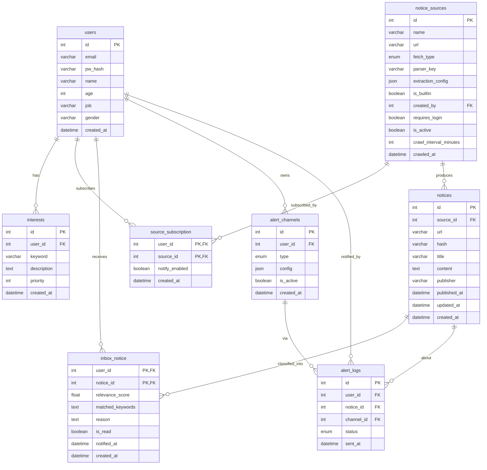

# kkongal — 데이터 모델 (Data Model)

> 공지 출처(notice_sources)를 전역으로 두고 구독(source_subscription)으로 연결하며, 수집한 공지(notices)를 사용자 관심 조건(interests)과 LLM으로 선별해 개인 피드(inbox_notice)로 만들고, 슬랙·이메일 채널(alert_channels)로 알림을 보낸다.

> FigJam ERD: https://www.figma.com/board/JGuLClw7NbtdzpWPj89m27/Kkongal-ERD

## 1. 엔티티 상세

표기: 🔑 PK, 🔗 FK.

### users — 사용자
| 필드 | 타입 | 비고 |
| --- | --- | --- |
| 🔑 id | int | |
| email | varchar(256) | unique |
| pw_hash | varchar(256) | 자체 인증(이메일+비밀번호) |
| name | varchar(128) | |
| age | int | nullable, AI 맥락 보조 |
| job | varchar(128) | nullable, AI 맥락 보조 |
| gender | varchar(128) | nullable |
| created_at | datetime | |
| updated_at | datetime | |

> age/job 등 프로필은 LLM 선별 시 사용자 맥락으로 활용할 수 있다(예: 직무 관련 공지 가중). 필수는 아님.

### notice_sources — 공지 출처(전역)
| 필드 | 타입 | 비고 |
| --- | --- | --- |
| 🔑 id | int | |
| name | varchar(128) | |
| url | varchar(1024) | |
| fetch_type | enum('static','dynamic') | static=BeautifulSoup, dynamic=Playwright |
| parser_key | varchar(128) | 사전 지원 소스의 파서 식별자(nullable) |
| extraction_config | json | 사용자 등록 시 목록/항목 셀렉터 등(nullable) |
| is_builtin | boolean | 사전 지원(true) / 사용자 등록(false) |
| 🔗 created_by | int | users.id, 사용자 등록 소스의 등록자(builtin이면 null) |
| requires_login | boolean | 로그인 필요 사이트(기본 false) |
| is_active | boolean | 크롤링 활성 여부 |
| crawl_interval_minutes | int | 수집 주기(기본 30분) |
| last_crawl_status | varchar(32) | ok/failed 등, 장애 격리 |
| last_error | text | nullable |
| crawled_at | datetime | 마지막 수집 시각 |
| created_at | datetime | |

> 기본은 `is_builtin=true`인 사전 지원 소스의 `parser_key`로 안정적 추출. 사용자 직접 등록은 `is_builtin=false` + `extraction_config`로 선택 지원.

### source_subscription — 구독(users × notice_sources)
| 필드 | 타입 | 비고 |
| --- | --- | --- |
| 🔑🔗 user_id | int | users.id |
| 🔑🔗 source_id | int | notice_sources.id |
| notify_enabled | boolean | 이 구독의 알림 on/off |
| created_at | datetime | 구독 시각 |

### interests — 관심 조건
| 필드 | 타입 | 비고 |
| --- | --- | --- |
| 🔑 id | int | |
| 🔗 user_id | int | users.id |
| keyword | varchar(128) | nullable(자연어만 쓸 수도) |
| description | text | 자연어 조건 |
| priority | int | 가중치/정렬 |
| is_active | boolean | |
| created_at | datetime | |

### notices — 수집 공지(전역, 소스별)
| 필드 | 타입 | 비고 |
| --- | --- | --- |
| 🔑 id | int | |
| 🔗 source_id | int | notice_sources.id |
| url | varchar(1024) | 원문 링크 |
| hash | varchar(256) | 변경 감지용 콘텐츠 해시 |
| title | varchar(256) | |
| content | text | |
| publisher | varchar(128) | |
| published_at | datetime | |
| updated_at | datetime | 원문 변경 반영 시각 |
| created_at | datetime | 수집 시각 |

> 중복/변경 규칙: **동일성**은 `(source_id, url)`로 판단(유니크). 같은 url의 `hash`가 달라지면 **변경**으로 보고 `content`/`updated_at` 갱신. url이 불안정한 소스는 `(source_id, hash)`로 대체.

### inbox_notice — 선별 결과(users × notices)
| 필드 | 타입 | 비고 |
| --- | --- | --- |
| 🔑🔗 user_id | int | users.id |
| 🔑🔗 notice_id | int | notices.id |
| relevance_score | float | LLM 관련도 |
| matched_keywords | text | 매칭 키워드(JSON 문자열 권장) |
| reason | text | 선별 사유 |
| is_read | boolean | 읽음 여부 |
| notified_at | datetime | 알림 발송 시각(null=미발송, 중복 알림 방지) |
| created_at | datetime | 선별 시각 |

### alert_channels — 알림 채널 연동
| 필드 | 타입 | 비고 |
| --- | --- | --- |
| 🔑 id | int | |
| 🔗 user_id | int | users.id |
| type | enum('email','slack') | (kakao는 후순위) |
| config | json | email: {address}, slack: {webhook_url} |
| is_active | boolean | |
| created_at | datetime | |

> MVP는 슬랙 Incoming Webhook(`webhook_url`)과 이메일(`address`, 기본값 users.email)로 단순화. `config`를 JSON으로 두어 채널 확장 시 스키마 변경을 줄임.

### alert_logs — 발송 이력
| 필드 | 타입 | 비고 |
| --- | --- | --- |
| 🔑 id | int | |
| 🔗 user_id | int | users.id |
| 🔗 notice_id | int | notices.id |
| 🔗 channel_id | int | alert_channels.id |
| status | enum('success','failed','skipped') | |
| error | text | nullable |
| sent_at | datetime | |

> 채널별 발송 결과 추적. 시간이 빠듯하면 `inbox_notice.notified_at`만으로도 중복 방지는 충족되며, `alert_logs`는 Should로 둔다.

---

## 2. 관계 및 처리 파이프라인

**관계**
- users 1 — N interests
- users N — M notice_sources (via source_subscription)
- notice_sources 1 — N notices
- users N — M notices (via inbox_notice, 선별 결과)
- users 1 — N alert_channels
- (users, notices, alert_channels) — N alert_logs

**파이프라인**
1. 사용자가 소스 구독(`source_subscription`)과 관심 조건(`interests`)을 등록.
2. 스케줄러가 `crawl_interval_minutes` 주기로 활성 소스를 크롤링 → 신규/변경 공지를 `notices`에 적재(동일성·해시 규칙 적용).
3. 신규/변경 공지에 대해, 그 소스를 구독한 각 사용자의 `interests`와 LLM으로 매칭 → 관련 시 `inbox_notice` 생성(score·keywords·reason).
4. `notified_at`이 null인 `inbox_notice`를, 사용자의 활성 `alert_channels`(슬랙/이메일)로 발송 → `notified_at` 갱신, `alert_logs` 기록.
5. 대시보드는 사용자의 `inbox_notice`를 출처·점수·기간으로 조회/정렬해 표시.

---

## 3. 인덱스 · 제약 (권장)

- `users.email` UNIQUE
- `notices` UNIQUE `(source_id, url)`  ← 중복 적재 방지
- `notices` INDEX `(source_id, published_at)`  ← 최신 공지 조회
- `inbox_notice` INDEX `(user_id, created_at)`, `(user_id, is_read)`
- `source_subscription` PK `(user_id, source_id)`
- `alert_logs` INDEX `(user_id, sent_at)`

---

## 4. ER 다이어그램 (Mermaid)

> DB 설계 도구나 GitHub 등에 그대로 붙여 볼 수 있다.

